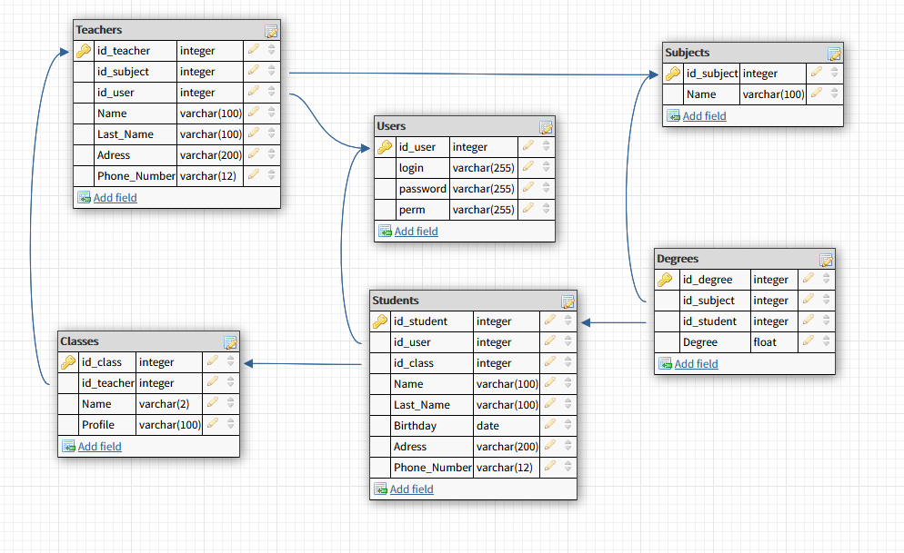

# School-Database-Manager-PHP

# Database Scheme

Simple school database management system.

Features:
-Object oriented PHP
-MySQLi
-Login system for students, teachers and admins
-Protected from SQL Injection
-Try/Catch Exceptions for SQL errors